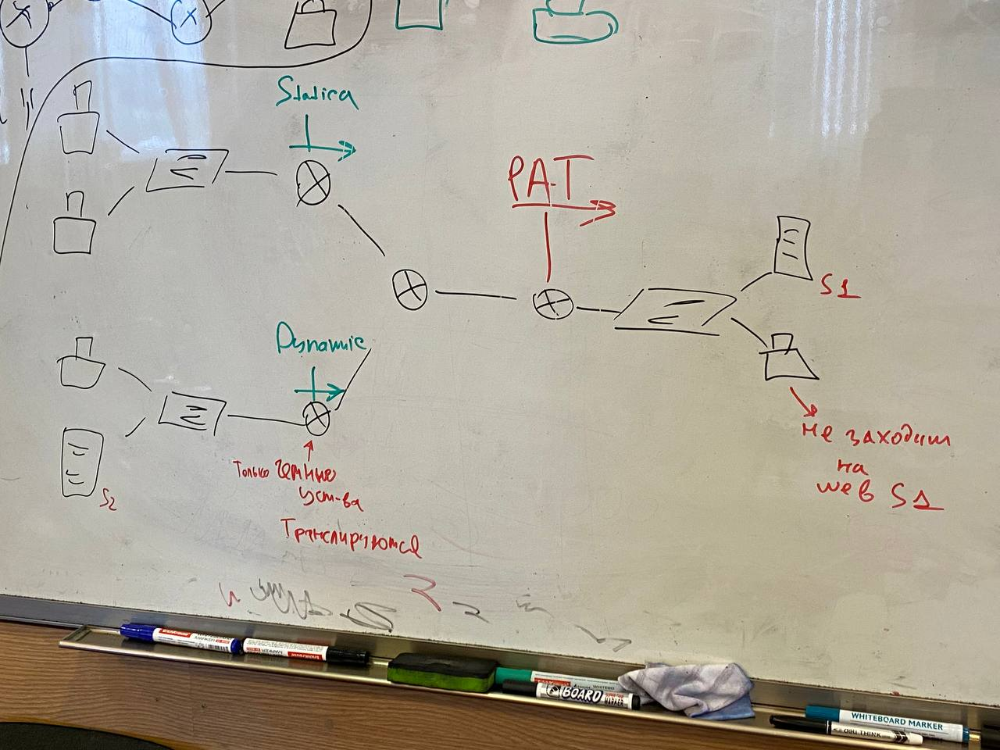
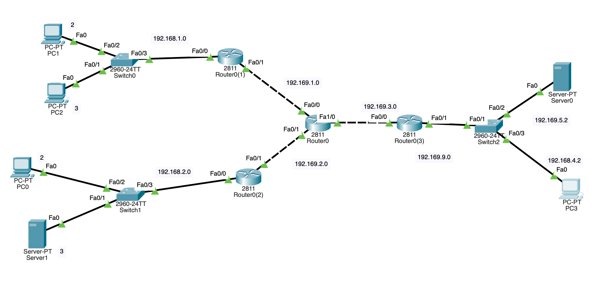
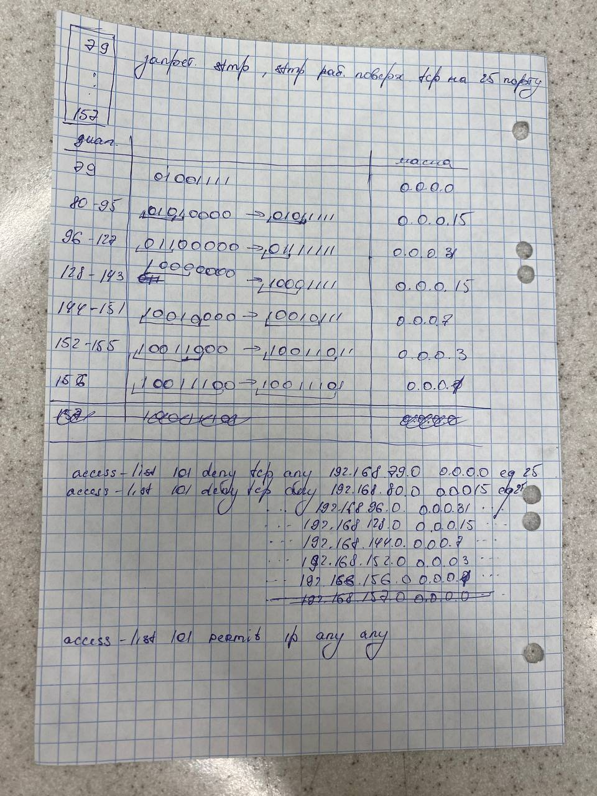

## acl + nat

Топология  




Было 2 защиты: на аксес-листы и на нат.  
### ACL  
Запретить smtp для портв 79 - 157.



### NAT  
Настроить email, чтобы сообщение исходило из правого нижнего компа и было получено на левом нижнем сервере. И наоборот. Прикол в том, что маил должно пройдет тогда через пат (подмена ипшника) и через нижний левый роутер (еще одно подмена).

Необходимые команды:  
``` ip nat inside source static 192.168.2.4 192.168.4.40 ``` на роутере (не пат)  
``` ip nat inside source static tcp 192.168.2.3 25 192.169.3.2 25 ``` на пате  

 Тут первом указывается локальная сеть, второй - глобальная.
